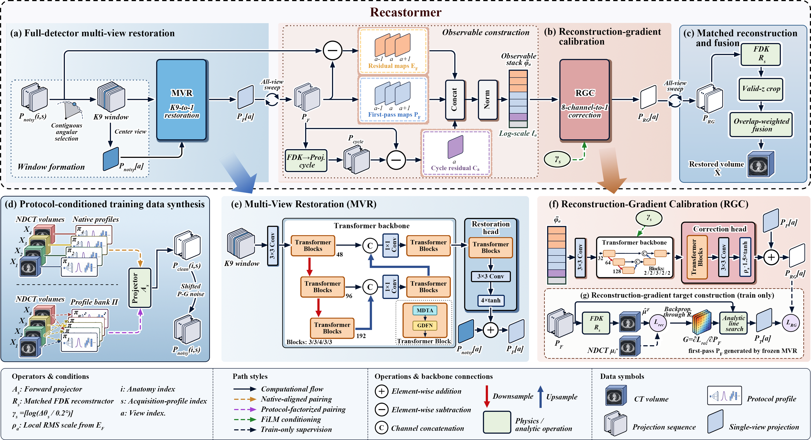

# Recastormer

This repository accompanies **Recastormer: A Unified Reconstruction-Aware Transformer for Cross-Protocol Projection Data Restoration in 3D Low-Dose CT**.

Recastormer combines multi-view restoration (MVR) and reconstruction-gradient calibration (RGC) within the projection domain, supported by a protocol-driven 3D simulation pipeline.

Code, configurations, and pretrained weights are being prepared for release. The instructions below describe the intended usage after release.



## 1. Environment Setup

Create the environment on Linux:

```bash
conda create -n recastormer python=3.9 -y
conda activate recastormer
python -m pip install torch==2.5.1 --index-url https://download.pytorch.org/whl/cu121
python -m pip install -r requirements.txt
```

Obtain CTorch 1.0 following the [AIAI-CTorch instructions](https://github.com/JHU-AIAI-Shared/AIAI-CTorch#request-access), then install it with a compatible CUDA Toolkit and C++ compiler:

```bash
python -m pip install --no-build-isolation /path/to/AIAI-CTorch
```

## 2. Data Preparation

The pipeline uses two types of data:

- **CT image volumes:** normal-dose CT (NDCT) images used for simulation, training supervision, and evaluation.
- **Projection data:** clean and noisy measurements generated by simulation. Recastormer operates on projections; reconstructed LDCT images alone cannot serve as its input.

1. Save NDCT images as 3D `.npy` volumes in **Hounsfield units (HU)**, ordered as **[z, y, x]**, with positive LPS orientation.
2. Select a reference configuration from `configs/`: `siemens.yaml`, `ge.yaml`, `philips.yaml`, or `united_imaging.yaml`. Verify the image dimensions, voxel spacing, and acquisition geometry for your data.
3. Set the data paths and patient splits. Keep all scans from each patient in the same split. Example fields:

```yaml
data:
  root: /path/to/ndct
  cases:
    - id: case_001
      patient: patient_001
      ndct: case_001/NDCT.npy
      split: train

run:
  output: ../runs/siemens
  device: cuda:0
  doses: [0.10]                   # 10% relative dose
  projection_cache: clean
  result_name: recastormer
```

Keep the remaining fields in the selected YAML. `ndct` paths are relative to `data.root`; other relative paths resolve from the YAML file.

Generate the simulated data:

```bash
python simulate.py --config configs/siemens.yaml
```

Simulation generates projections, adds low-dose noise, and reconstructs the corresponding LDCT volumes. Volumes are saved under `run.output/ldct/`, and projection caches under `run.output/projections/`, together with acquisition and slice-mapping metadata.

Use `projection_cache: clean` to retain clean projections; noisy inputs are generated from the recorded noise settings and seeds. Use `both` to also retain the noisy projections. Keep the original NDCT volumes available for training and evaluation.

## 3. Training

After simulating the cases marked `split: train`, train MVR and RGC sequentially:

```bash
python mvr.py train --config configs/siemens.yaml
python rgc.py train --config configs/siemens.yaml
```

RGC loads the trained MVR checkpoint and automatically prepares reconstruction-gradient supervision before training. Adjust the training settings under `mvr_train` and `rgc_train` in the YAML.

Checkpoints are saved as `mvr.pt` and `rgc.pt` under `run.output/checkpoints/`. See `configs/paper/` for paper-specific protocol and split settings.

## 4. Testing

Prepare cases with `split: test` and run simulation as above. Restore and evaluate them using:

```bash
python test.py --config configs/siemens.yaml
```

Testing uses the completed local MVR/RGC checkpoint pair. To use a pretrained pair, specify `weights.mvr` and `weights.rgc` in the YAML.

For inference without quantitative evaluation:

```bash
python test.py --config configs/siemens.yaml --mode infer
```

Inference restores the projection sequence and reconstructs the final CT volume. With `result_name: recastormer`, restored volumes and evaluation results are saved under `run.output/recastormer/`.
